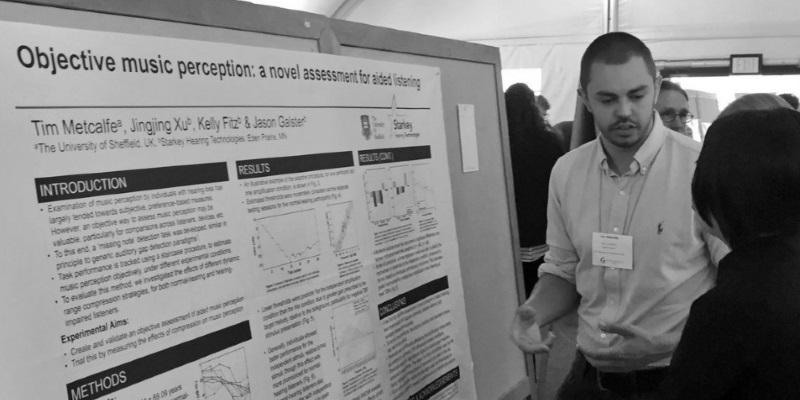

\

I'm a third-year PhD student at The University of Sheffield, UK, studying under the supervision of [Dr. Renee Timmers](https://www.shef.ac.uk/music/staff/academic/reneetimmers) (Dept. of Music) and [Prof. Guy Brown](http://staffwww.dcs.shef.ac.uk/people/G.Brown/) (Dept. of Computer Science). My doctoral research is concerned with the perception of speech and music by hearing-impaired listeners, including cochlear implant and hearing aid users. My thesis addresses auditory perception of emotion, and the objective assessment of music perception. My research makes use of interdisciplinary methods, incorporating experimental psychology, psychoacoustics, and computer modelling.

### Links:&emsp;[Pitchfork project](https://megawalrus.github.io/posts/pitchfork_project)&emsp;&middot;&emsp;[Github](https://github.com/megawalrus) &emsp;&middot;&emsp;[Twitter](https://twitter.com/TimJMetcalfe?lang=en)&emsp;&middot;&emsp;[Academia](https://sheffield.academia.edu/TimMetcalfe)&emsp;&middot;&emsp;[My CV](docs/Metcalfe_CV.pdf)
