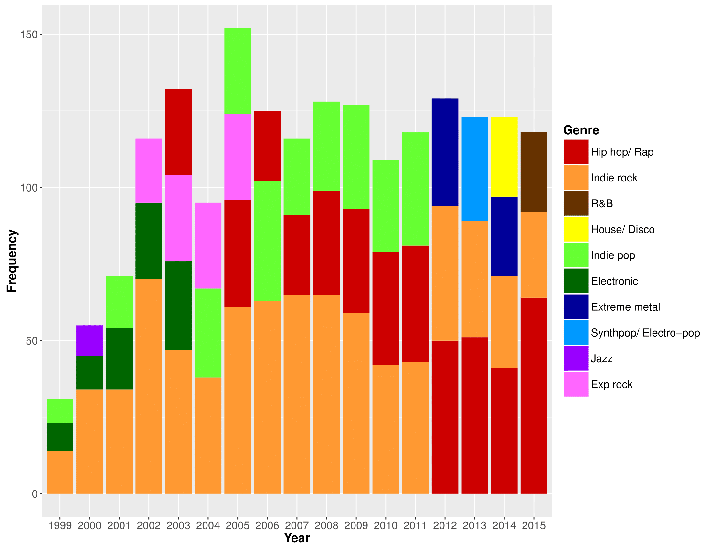
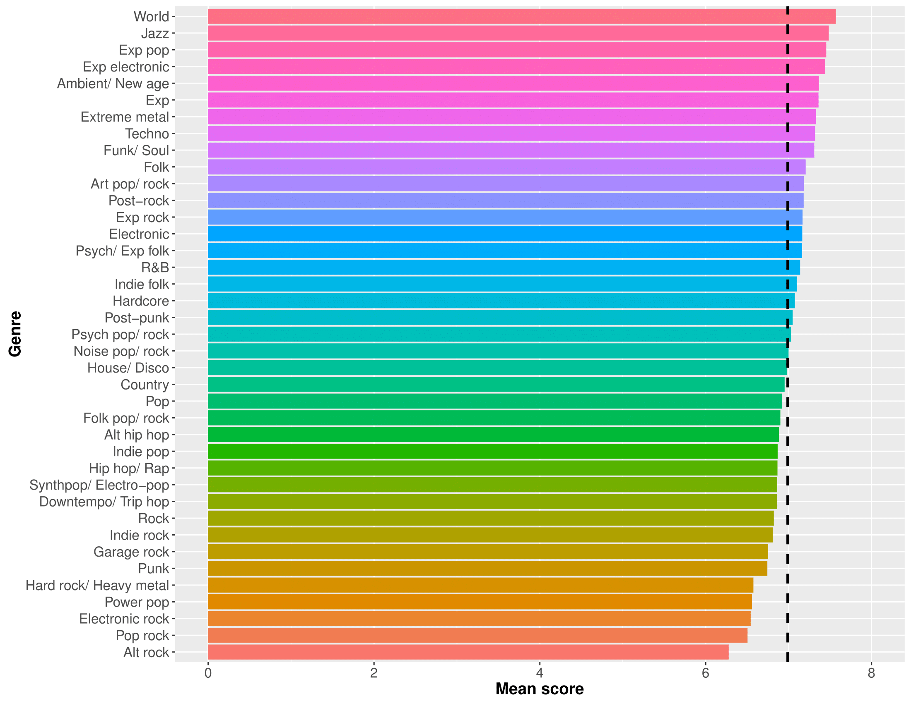
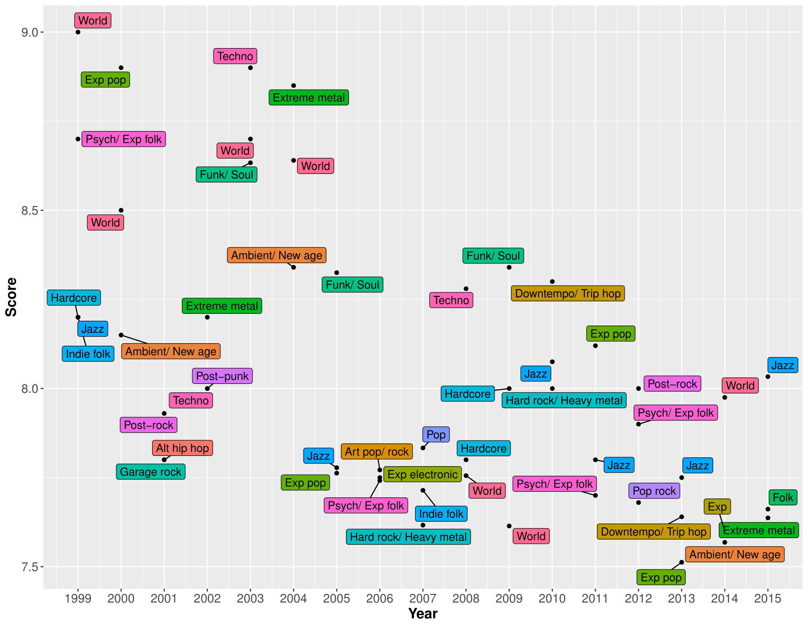
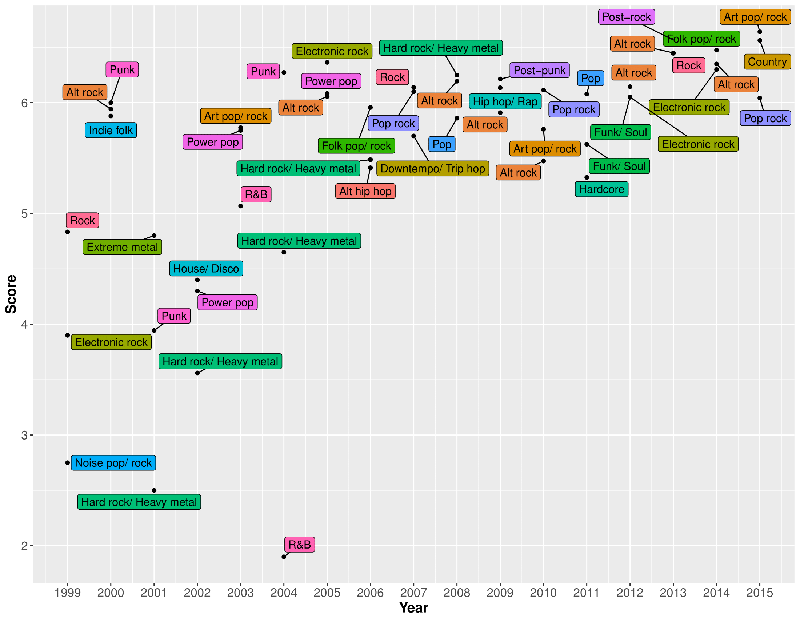

```{r setup, include=FALSE}
knitr::opts_chunk$set(echo = TRUE)
```

## Introduction

Reviewers exert great influence on the consumption of contemporary popular music. For example, the 'Pitchfork effect' -- named after the [hugely popular online music magazine](http://pitchfork.com) -- refers to the tendency for sales to increase immediately after acclaim by a well-known reviewer. Therefore, it is worthwhile to explore any potential trends and biases in critical opinion. Recently, an [SQL database](https://github.com/nsgrantham/pitchfork-reviews) was compiled, containing over 17,000 music reviews published by Pitchfork between 1999 and 2016. This dataset offered a unique opportunity to study differences in critical opinion, both as a function of time and of different individual reviewers. However, no information about musical genre was included, which might be informative with respect to highlighting more overarching biases in reviews. To this end, I began updating the 'Pitchfork database' by adding genre labels for each review, to allow for some additional analyses.

**DISCLAIMER:** the data here are based on only half of the Pitchfork database (~8,000 reviews). Tagging each album by musical genre turned out to be quite an arduous process, and as such I haven't finished doing it just yet. Accordingly, my interpretations of the visualizations below are somewhat speculative...

## Updating the Pitchfork database

### Step 1
Initially, (and somewhat na&iuml;vely), I built a web scraper with `Python` to search for each album's genre online and download the result. While this did help provide a 'first guess' at the genre, the approach was fraught with errors, and lots of albums were too obscure to be found using this method.

### Step 2
Next, I manually (and somewhat painstakingly) searched through the actual reviews for clues. In some cases, Pitchfork are very explicit about the genre of music being reviewed, but in other cases not so much. For the latter, I searched other review sites, to find the best possible general consensus. Sites like [Allmusic](http://www.allmusic.com/), [Discogs](https://www.discogs.com/search/) *etc.* were helpful here, and in semi-rare cases, the artists' own websites were kind enough to identify their genre.

Initially, I coded each album reviewed at the most specific 'genre level' possible. For example, if Pitchfork described something as 'deep house' then it got labelled as such, as opposed to something more generic like 'dance'. This approach resulted in a total of 173 genres, from household names like House and Indie rock, to the more niche sounds of Footwork and Blackgaze.

### Step 3
Lastly, any genres that accounted for < 1% of the sample were either:

A) reclassified at a higher level (*e.g.* death metal, black metal *etc.* became 'Extreme metal'), or 
B) excluded from the dataset, if the above was not feasible (e.g. spoken word, comedy, classical).

The reason for this approach was, in a sense, to assume nothing about the genres to begin with -- to let the data decide which genres the reviews should be split into. This also means that, for the resulting genres, there are hopefully enough exemplars in the database from which to draw meaningful conclusions, *i.e.* I won't end up trying to comment upon how a genre is reviewed, based on only one or two albums.

## Which musical genres does Pitchfork review the most?

Once everything had been tagged and reclassified, there were 39 genres in total:

\


Given Pitchfork's reputation as primarily an Indie music publication, it's unsurprising that Indie rock tops the list by some way, with Indie pop also occupying third position. Hip-hop is the second-most commonly reviewed genre by Pitchfork, which is maybe slightly more of a surprise. Elsewhere, the range of genres being reviewed is reasonably diverse, and Pitchfork are reviewing a lot more Country than I'd realised (I think we have a tendency to underestimate the popularity of Country, here in the UK).

Also of note, is that the relationship between a genre's general popularity and its prevalence in Pitchfork is far from linear. Experimental music, Extreme metal and Alternative hip hop, for example, are all more frequently reviewed than Pop music.

### Has this changed over time?

Next, I wanted to take a look at how Pitchfork's reviewing habits might have changed over time, by looking at the most frequently reviewed genres on a year-by-year basis. For the sake of simplicity, this plot shows the top three most-reviewed genres for each year:

\


Between 1999-2011, Indie rock was the most reviewed genre by Pitchfork -- no surprises there. But, since 2012, they've reviewed more Hip-hop than anything else, and in fact this difference still seems to be increasing. Is it time that we started referring to Pitchfork as primarily a Hip-hop publication? Or maybe this swing is reflective of a wider cultural trend -- arguably Hip-hop has moved towards the forefront of popular music consciousness in recent years, analogously to the [proliferation of Indie rock and Post-punk revival in the early 2000s](http://pitchfork.com/features/article/7704-the-decade-in-indie/). Perhaps it has something to do with Hip-hop's recent affinity for the mixtape, a medium that meets ["consumer demand for free, original rap music"](http://www.billboard.com/biz/articles/news/1168371/the-economy-of-mixtapes-how-drake-wiz-khalifa-big-krit-figured-it-out), and that naturally results in a plethora of Independent releases for Pitchfork to review?

Elsewhere, it looks like Indie pop  also fell out of favour slightly, around 2012, while electronic music peaked from 1999-2003 -- coinciding roughly with a time that so-called ['Intelligent Dance Music](http://pitchfork.com/features/lists-and-guides/10011-the-50-best-idm-albums-of-all-time/) was enjoying a degree of popularity.

**Note:** For some years (*e.g.* 2014), four genres are plotted. This denotes a tie, *i.e.* Extreme metal and House/ Disco were joint-third most-reviewed genres for that year.

## What scores does Pitchfork assign?

Of course, Pitchfork has become well-known for its numerical scores that are assigned to reviewed albums -- each review is accompanied by a score ranging anywhere from a scathing [0.0](http://pitchfork.com/reviews/albums/9464-shine-on/) to the coveted [10.0](http://pitchfork.com/reviews/albums/14880-my-beautiful-dark-twisted-fantasy/). First, let's take a look at how these scores tend to be distributed, on the whole:

\


The overall score data are left-skewed (or 'negatively skewed'), with a mean of 7.0, implying a bias towards giving more positive reviews (assuming that, without any bias, the mean score would be around 5.0). The most obvious explanation for this might be a [positive bias in popular music criticism more generally](http://www.popmatters.com/post/the-bias-toward-positive-reviews/). Anecdotally, it also seems that Pitchfork review quite extensively the discographies of artists that they like, whilst generally avoiding repeatedly panning disliked artists. Although I haven't included a graph here to show it, average scores overall have hovered very consistently around the 7.0 mark, over the years.

## Which genres does Pitchfork tend to rate most highly?

So, on to perhaps the most interesting question: are there any musical genres that Pitchfork consistently reviews more highly than others?

\


While most genres tend to score around the 7.0 mark on average (denoted by the dashed line), there's some interesting variability here. At the top, perhaps a bit surprisingly, are World and Jazz. I would guess that the reason for this is that Pitchfork does not review these genres very often (as we saw from the first graph). Therefore, when they do review them, it's likely because the album in question is of particularly high quality or is otherwise noteworthy, thereby inflating the average score for these genres. At the other end of the spectrum, it's not too surprising to see Pop rock and Power pop hanging out, since Pitchfork has a reputation for eschewing these 'poppier' genres. Alt rock being the least well-reviewed genre might come as something of a surprise, though. The problem with the 'Alt rock' moniker is that it's been used to refer to drastically different styles of music, across different decades. I'm fairly confident that the brand of Alt rock maligned here is the work of the poppier end of the spectrum, exemplified by Keane *et al.* as opposed to, say, Sonic Youth.

As might be expected, Experimental music and all of its hybrid genres (Experimental rock, Experimental electronic *etc.*) tended to score above average. One might assume that these genres would have highly variable scores (since experimentation naturally leads to inconsistent or at least unpredictable results). However, Pitchfork appears to prize experimentation quite highly, and perhaps punishes musical 'blandness' or 'conservativeness' with lower scores than music which is artistically ambitious but flawed in execution. Of course, it might also be the case that labels like 'Experimental' and 'Art' music lead to a positively-biased appraisal of a work's artistic value.

Also of interest is that Heavy metal tended to score relatively poorly, whereas Extreme metal seems to fare much better. Could this be because, within some of these genres, there's a [tendency to equate extremeness with authenticity](https://www.degruyter.com/view/j/comm.2014.39.issue-2/commun-2014-0010/commun-2014-0010.xml), and therefore artistic value? Or perhaps it's simply because Heavy metal and Hard rock are perceived as more 'mainstream'? Either way, this discrepancy highlights the importance of assigning musical genres based on what actually emerged from the data, as opposed to assuming a list of genres to begin with. The latter approach would likely have used far fewer genre categories, thereby missing interesting nuances such as the this.

## Have Pitchfork's favourite/ least favourite genres changed over time?

Lastly, let's explore the changing fates of different musical genres over the years. These two graphs show, respectively, the top three best- and least-well-reviewed genres for each year. Again, only three genres are included, in order to contrain the plot to a reasonable size:

\


The most immediately obvious trend, when looking at this graph, is that there seems to be a 'regression to the (overall) mean' over time. That is, even though the overall mean score has stayed around 7.0 over the years, the very highest rated genres have become less highly-rated over time. This probably means that any preferences that Pitchfork did have for specific genres has become less pronounced over time -- consistent with the publication reviewing increasingly diverse material. As Pitchfork reviews more albums from each genre over time, it becomes increasingly unlikely that any one genre will receive an inflated overall rating, based on one or two rave reviews.

Looking at individual genres, it's clear that the high average scores awarded to World and Jazz music have been fairly consistent over time. I think this is most likely because, even though Pitchfork is clearly becoming more diverse, these genres are still far from its main focus, and therefore still to tend to mostly get reviewed when particularly exceptional or noteworthy albums come along.

There are also a couple of appearances here by genres that were among the worst-reviewed overall. For example, Pop-rock was the third-best-reviewed genre in 2012, despite being the second-worst reviewed genre overall. I think this illustrates that, although Pitchfork clearly has its preferences genre-wise, these are not immutable. Similarly, despite poor overall performance, Hard rock/ heavy metal had a good showing in 2007 and 2010. A sensible explanation for this effect might be that Pitchfork's preferences and biases are geared more towards musical 'movements' than genres *per se*. For example, it's likely that Pitchfork's apparent disdain for Hard rock/ heavy metal is actually driven by a dislike of the genre's early 2000s manifestation -- namely, the [critically-derided Nu-metal/ Rap-rock](http://www.nme.com/blogs/nme-blogs/10-reasons-why-nu-metal-was-the-worst-genre-of-all-time-764675).

### The worst-reviewed genres, over time

Finally, let's look at how Pitchfork's least favourite genres have changed over the years:

\


Looking at this graph, it's obvious that R&B had a tough time in 2004! On the whole, we can see the same trend as in the previous graph, albeit in reverse. That is, even the genres that receive the lowest reviews on average have gradually been receiving higher scores over time.

As in the previous graph, there are also biases that have endured over time. The clearest example in this case is Alt rock -- the worst reviewed genre overall, and also making the bottom three in 2000, 2005, 2008, 2009, 2010, 2012, 2013 and 2014. By comparison, Hard rock/ heavy metal has fared a little better, gradually improving between 2001-2008, at not appearing in the bottom three since. This perhaps supports my previous suggestion -- as the genre moved away from the Nu-metal sound that dominated the early 2000s, Pitchfork's appraisal of the genre steadily improved.

As for R&B's abysmal showing in 2004 -- a similar principle might apply. This genre had heavily infiltrated the mainstream around the early 2000s, and Pitchfork apparently did not enjoy this type of radio-friendly R&B. From the mid-to-late 2000s and beyond, [the rise of 'Alternative R&B'](https://www.theguardian.com/music/2015/jun/29/how-r-b-got-its-groove-back) has maybe led to Pitchfork having a more favourable opinion of the genre.

## Some (brief) conclusions...

Even though I analysed approximately 8,000 reviews, I'll refrain from drawing any strong conclusions until I've tagged the entire dataset. With that said, there's definitely evidence (as you'd expect) that Pitchfork reviews some genres more frequently than others. What's a little more surprising (to me at least) is that, as of 2012, the most-reviewed genre has been Hip-hop. It'll be interesting to see whether or not this trend continues, once I can get some data from 2016-2017 to look at...

Secondly, it does appear that Pitchfork might have some subtle preferences for certain genres over others. Based on the data observed so far, the clearest examples are:

A) World and Jazz music are usually very well-reviewed, relative to other genres.
B) Alt rock has very consistently received below-average reviews.
C) Less clearly 'mainstream' genres (e.g. Experimental music and its various hybrids) seem to be slightly preferred, on the whole.

Lastly however, I think that discussing reviewing preferences in reference to musical genre might be something of an oversimplification. While there may be cases in which an entire genre is liked or disliked more than others, it might make more sense to instead talk about musical 'movements' or 'scenes'. Therefore, rather than making a blanket statement like "Pitchfork does not like Hard rock/ heavy metal" we might instead say that Pitchfork did not enjoy the particular style of Hard rock/ heavy metal that was prevalent in the mainstream in the early 2000s (of course, for this specific example might need some more evidence first). In summary, we can probably understand a lot more about reviewing biases if we take into account not just the musical genre being reviewed, but its interaction both with time, and with the cultural 'mainstream'.

In the near future (assuming that anyone is interested), I'll aim to finish tagging the entire database, and will then update this post, maybe with some more sophisticated analyses, too.

**This project owes a huge debt to the work of [Neal Grantham](https://nsgrantham.github.io/), whose post ['Who Reviews the Pitchfork Reviewers?'](http://nsgrantham.github.io/pitchfork-reviews/) gave me the inspiration to carry it out.**

### [Back to Home](https://megawalrus.github.io/)
